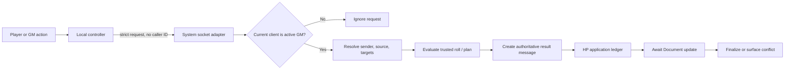

# Swords & Wizardry Remediation Design

Status: implementation-ready design
Design date: 2026-08-29
Baseline branch: `dev`
Baseline commit: `e20c70ce748d08f644830cee5243f451619449e5`
Source review: [`CODE_REVIEW.md`](CODE_REVIEW.md)
Supported runtimes: Foundry VTT 13.351 and 14.367

## 1. Purpose and scope

This document defines the fixes for SW-01 through SW-16 in `CODE_REVIEW.md`. It is a design, not an implementation. The intended outcome is a system in which:

- every shared HP, prepared-spell, and hidden morale mutation has one authenticated authority;
- weapon and spell actions retain stable source and target identity;
- Foundry Document lifecycle methods and persistence APIs are respected;
- creation tools either complete coherently or leave no partial documents;
- the same release artifact passes a system-wide v13/v14 GM/player gate; and
- legacy quality debt is removed without changing Swords & Wizardry rules.

The work must not change attack math, side initiative rules, spell formulas, encumbrance thresholds, healing limits, or the meaning of the `DM must apply damage / healing` setting except where current behavior is defective or insecure.

### Non-goals

- No new rules automation, compendium content, Active Effect feature, or socket-library dependency.
- No destructive rewrite of historical ChatMessages or existing Actor/Item data.
- No pruning of the legacy icon library in this release; arbitrary world documents may already reference those paths.
- No release, tag, marketplace submission, or upstream PR submission as part of implementation.

## 2. Refined analysis

The review findings are valid, with one important security refinement discovered while tracing the complete Foundry permission path.

### 2.1 Player-authored ChatMessage flags are not authoritative

Foundry v13 and v14 give a ChatMessage's author owner-level permission, including update permission. A player can also create a ChatMessage whose initial flags are arbitrary. The existing Spell Effects fingerprints detect accidental/stale changes, but they are a deterministic non-secret hash and do not establish authenticity.

Consequences:

- A player-authored spell-result message cannot be treated as proof of its formula, total, action, targets, or source snapshot.
- Cross-checking one player-authored result against another player-authored source card is insufficient; the same player owns both messages.
- When automatic damage/healing is enabled, an active GM must not apply HP solely from those flags.
- A GM-facing Apply button must not make a forged player card look authoritative.

The fix is not cryptographic signing in client code; every client has the same code and secrets cannot be protected there. The active GM must re-resolve the real source Item and Actor, validate the authenticated requester, evaluate any HP-changing roll, and create the result message. Result flags created and owned by a GM then become the durable application capability.

This elevates the concurrency-only interpretation of SW-07 into a trust-boundary requirement and is incorporated throughout this design.

### 2.2 Native package sockets provide authenticated sender identity

The installed v13.351 and v14.367 servers append the authenticated sender's user ID as the second argument delivered to custom world/system/module socket listeners. The current listener ignores that argument. The new transport will accept `(envelope, senderUserId)` and will never accept a caller ID inside the envelope.

This version-sensitive behavior will be isolated in one adapter and covered by real two-client contract tests. It will be recorded in compatibility notes because package-socket details are less stable than Document APIs.

### 2.3 Active Effect code is currently dead

`module/helpers/effects.mjs` is never imported, and `module/actor/effects.hbs` is preloaded but is not a sheet part or partial. Porting this unreachable code to the v14 duration schema would create a feature that does not currently exist. The smallest correct fix for SW-12 is to remove the dead helper, template, preload entry, and dedicated SCSS. If Active Effect management is wanted later, it should be a separate feature design with explicit v13/v14 behavior.

## 3. Architectural decisions

### D1 — One active GM owns shared mutations

`game.users.activeGM`/`game.user.isActiveGM` exists in both supported versions. Only that client may:

- apply damage or healing to an Actor;
- consume a prepared spell on behalf of another client;
- evaluate HP-changing spell and weapon rolls used for automatic application;
- perform a hidden morale roll requested by a non-GM; and
- finalize or recover an application audit entry.

Other GMs may press manual Apply controls, but their client sends an authenticated request to the active GM. When no active GM exists, the operation fails closed with a localized notice and changes nothing.

### D2 — Requests carry references, never mutation values

A client request may identify an operation, source Document/message, target UUIDs, and a small allowlisted option such as `full`, `half`, `double`, or `healing`. It must not supply the authoritative roll total, HP value, caller ID, Actor update object, or arbitrary formula.

The active GM resolves the source Documents and derives all mutation values from validated source data or an active-GM-evaluated Roll.

### D3 — Authoritative result messages are durable capabilities

Spell and weapon cards which do not mutate shared state may still be authored by a player. Any result capable of changing HP is evaluated and created by the active GM. Its flags include:

- a versioned message kind;
- the authenticated requesting user ID;
- source Actor and Item UUIDs;
- the source card/attack message UUID where applicable;
- a normalized action/formula snapshot and fingerprint;
- the GM-evaluated Roll formula and total;
- stable target UUIDs and display-only target snapshots;
- an allowlist of permitted application modes; and
- a versioned application ledger.

The active GM revalidates the source Item and requester before creating this message. Application requests derive kind and multiplier from the message's allowlisted mode rather than trusting button data.

### D4 — Use a write-ahead state machine; never blind rollback

Foundry does not expose a public atomic transaction spanning an Actor and ChatMessage. The current “update Actor, update message, then restore old HP on audit failure” can overwrite an unrelated later HP edit.

Every HP application will instead use a message-ledger state machine:

1. Validate source, requester, target, mode, current HP, and duplicate status.
2. Persist a `pending` ledger entry containing the expected old/new HP and target-state fingerprint.
3. Re-resolve the target and reject with `conflict` if its fingerprint changed.
4. Update HP through `Actor.update` and await it.
5. Mark the entry `applied` with final state and timestamps.

No automatic rollback occurs. If step 5 fails, the durable `pending` entry supports recovery:

- current state matches the recorded “before” state: retry the Actor update;
- current state matches the recorded “after” state: finalize the audit;
- current state matches neither: mark `conflict` and require GM review.

All operations with the same application ID share one active-GM promise lock. The persisted ledger supplies idempotency across reloads and active-GM failover.

### D5 — Preserve behavior, but fail closed for untrusted historical cards

- Existing Spell Effects Item data and spell card/result schema v1 remain readable.
- Existing player-authored HP result messages are displayable but cannot be applied after the security change; their controls are replaced with a localized “reroll to apply” notice.
- Existing legacy weapon messages contain no trustworthy UUID/roll capability and become display-only.
- New messages use the new authoritative schemas.
- No historical ChatMessage migration is attempted.

### D6 — Character creation remains player self-service when Foundry permits it

The current UI exposes the creator to players, which indicates a self-service intent. The fixed behavior is:

- show it only when `game.user.can('ACTOR_CREATE')`;
- recheck permission at submit time;
- grant OWNER only to the creating user and set default ownership to NONE; and
- rely on GM status for implicit GM control.

If the product owner instead wants GM-only character creation, this is the one behavior decision to change before implementing SW-13.

## 4. Target structure and control flow

The implementation should add focused services without reorganizing unrelated sheets or data models.

```text
module/
|-- authority/
|   |-- domain.mjs              # strict envelope validation and result codes
|   `-- system-socket.mjs       # start/stop, sender identity, active-GM dispatch
|-- hit-points/
|   |-- domain.mjs              # HP calculation, modes, fingerprints, ledger transitions
|   |-- result-adapters.mjs     # spell/weapon authoritative-message readers
|   `-- application-service.mjs # active-GM application and recovery
|-- weapons/
|   |-- domain.mjs              # immutable attack/damage plans
|   |-- service.mjs             # active-GM attack/damage evaluation and messages
|   `-- chat-controller.mjs     # delegated attack/damage/apply controls
|-- rolls/
|   |-- service.mjs             # save, feature, morale message orchestration
|   `-- rolls.mjs               # calculation-only Roll subclasses, if still useful
|-- tokens/
|   |-- hit-dice.mjs            # pure HD parser/formula builder
|   `-- token.mjs
`-- importer/
    |-- domain.mjs              # pure stat-block parser and validation
    `-- importer.mjs            # ApplicationV2 and one mutation boundary
```

Existing Spell Effects services should delegate HP application to `hit-points/application-service.mjs`; their non-HP action planning and card UI remain in `module/spells`.



## 5. Shared protocols

### 5.1 Socket envelope

The envelope is a plain object with an exact known-field set:

```js
{
  schemaVersion: 1,
  type: 'request',
  requestId: 'random-16-to-64-character-id',
  operation: 'weapon.attack',
  payload: {}
}
```

Responses use `type: 'response'`, the same `requestId`, a server-derived `recipientUserId`, and a structured result:

```js
{
  schemaVersion: 1,
  type: 'response',
  requestId,
  recipientUserId,
  result: { status: 'success', code: null, messageUuid: '...' }
}
```

Rules:

- Validate the envelope before dispatch and reject unknown fields.
- `requestId` is generated before constructing the envelope and cannot be overwritten by payload spreading.
- The sender is the listener's second argument, never `payload.userId`.
- Requests are broadcast on `system.swords-wizardry`; only the current active GM handles them.
- Responses are safe to broadcast because only the matching `recipientUserId` resolves a pending promise and no hidden roll total or remaining HP is returned.
- Pending promises have a 10-second timeout and are always removed on response, timeout, stop, or socket replacement.
- The dispatcher has an explicit operation map; unknown operations return `UNKNOWN_OPERATION`.
- Each operation validates payload size, exact fields, UUID syntax, choices, and collection limits.
- Recheck `game.user.isActiveGM` immediately before every shared write.

Initial operation allowlist:

| Operation | Authorized requester | Result |
| --- | --- | --- |
| `weapon.attack` | GM or OWNER of source weapon/Actor | Active GM evaluates attack and creates attack message. |
| `weapon.damage` | GM or original authorized requester | Active GM evaluates damage from a trusted attack message and creates result. |
| `spell.hitPointResult` | GM or OWNER allowed to invoke source spell | Active GM evaluates damage/healing and creates result. |
| `spell.consume` | GM or OWNER of prepared source spell/Actor | Active GM consumes one prepared occurrence and finalizes card audit. |
| `hitPoints.apply` | GM only; automatic hook supplies authenticated author | Active GM applies one allowlisted mode to one snapshotted target. |
| `morale.roll` | GM or OWNER of NPC | Active GM performs a GM-only morale roll. |

### 5.2 HP result capability

The common normalized result read by the application service is:

```js
{
  schemaVersion: 1,
  messageUuid,
  sourceKind: 'spell' | 'weapon',
  sourceActorUuid,
  sourceItemUuid,
  requestedBy,
  actionId,
  actionFingerprint,
  amount,
  targetUuids,
  modes: {
    fullDamage: { kind: 'damage', multiplier: 1 },
    halfDamage: { kind: 'damage', multiplier: 0.5 },
    doubleDamage: { kind: 'damage', multiplier: 2 },
    healing: { kind: 'healing', multiplier: 1 }
  },
  ledger: { schemaVersion: 1, entries: {} }
}
```

Spell damage exposes the three damage modes, spell healing exposes only healing, and weapon damage preserves the current four manual modes including healing. Automatic application always selects `fullDamage` for weapon/spell damage and `healing` for spell healing.

The deterministic application ID remains one-per-result-and-target regardless of mode. Once any mode is applied to a target, another mode cannot be applied from the same result.

### 5.3 Target-state fingerprint

The ledger records only state needed for conflict detection:

```js
{
  actorUuid,
  hp: actor.system.hp.value,
  modifiedTime: actor._stats?.modifiedTime ?? null
}
```

For synthetic Actors, the stable application target remains the TokenDocument UUID and the actor UUID is audit metadata. If a reliable Actor modified time is unavailable, HP plus the Token/Actor source UUID is used and recovery becomes conservative: ambiguous state is a conflict, not an assumed success.

### 5.4 Error contract

Services return data; controllers localize notices. Required statuses are:

- `success`, `duplicate`, `pending`, `conflict`, `cancelled`, `failure`, and `unsafe`;
- stable codes such as `NO_ACTIVE_GM`, `NOT_AUTHORIZED`, `SOURCE_NOT_FOUND`, `STALE_SOURCE`, `TARGET_NOT_FOUND`, `TARGET_NOT_ALLOWED`, `INVALID_REQUEST`, `ROLL_FAILED`, `UPDATE_FAILED`, and `AUDIT_FINALIZE_FAILED`.

No notice includes stack traces, passwords, raw socket payloads, or remaining target HP for players.

## 6. Detailed work packages

### WP-01 — Replace the legacy RPC and establish authority

Addresses: SW-01, part of SW-07, part of SW-10.

#### Files

- Add `module/authority/domain.mjs` and `module/authority/system-socket.mjs`.
- Update `module/swords-wizardry.mjs` composition and ready/teardown wiring.
- Remove `module/helpers/rpc.mjs` after all callers migrate.

#### Design

`SystemSocket` owns one listener, a pending-request map, and an operation registry injected at construction. `start()` and `stop()` are idempotent. The socket callback passes the server-provided sender ID to the selected handler. Direct/local active-GM calls go through the same handler and validation path; they do not bypass authorization merely to avoid a socket round trip.

The old `{recipient, operation, amount, data}` contract is not supported. There is no generic Actor-update operation.

#### Acceptance criteria

- A forged legacy packet changes nothing.
- A non-owner cannot invoke a source Item they do not own.
- With two GMs connected, exactly `game.users.activeGM` performs each request.
- Request retry after lost response returns the persisted prior outcome without another mutation.
- No listener or pending timeout remains after `stop()`.

### WP-02 — Unify spell and weapon HP application

Addresses: SW-01, SW-06, SW-07.

#### Files

- Add `module/hit-points/domain.mjs`, `result-adapters.mjs`, and `application-service.mjs`.
- Update `module/spells/application.mjs`, `service.mjs`, and `chat-controller.mjs`.
- Add `module/weapons/domain.mjs`, `service.mjs`, and `chat-controller.mjs`.
- Replace legacy weapon templates with versioned message templates under `module/templates/weapons/`.
- Remove `module/helpers/overrides.mjs` and the custom ChatMessage registration when parity is proven.

#### Spell flow

1. Posting a spell card remains local and non-mutating.
2. Invoking a damage/healing Spell Effect sends `spell.hitPointResult` to the active GM.
3. The active GM derives the authenticated requester from the socket, resolves the source card, Item, and Actor, and reads the current normalized action from the actual Item.
4. The source card snapshot must match the current action fingerprint. If not, return `STALE_SOURCE` and ask the user to post a new card.
5. The active GM resolves caster level, validates any prompted level, validates targets, evaluates the Roll, and creates the authoritative result message.
6. If `dmAppliesDamage` is false, the active GM applies the appropriate full mode through the common application service. If true, only GM clients receive enabled Apply controls.

Non-HP Spell Effects keep the current local evaluation path because they do not mutate shared Documents. Their message flags remain snapshots, not authority capabilities.

#### Weapon flow

1. `Item.roll()` for a weapon asks `WeaponService.attack(itemUuid, targetUuids)`.
2. The active GM validates sender ownership, source type, formula, settings, and target list; it then evaluates the attack and creates an authoritative attack message.
3. Attack flags store source UUIDs, normalized formula data, settings relevant to hit calculation, target snapshots, and hit/miss outcomes. Only hit-target UUIDs are eligible for damage.
4. The damage button sends only the trusted attack message UUID.
5. The active GM validates the attack capability, evaluates the snapshotted damage formula once, and creates an authoritative damage result with exactly the hit-target UUIDs.
6. Automatic/manual application follows the common ledger flow.

Changing selected targets after the attack has no effect. Unlinked Token sources and targets use Scene/Token UUIDs and resolve to their synthetic Actors immediately before each operation.

#### Backward behavior

- Current weapon manual buttons remain Damage, Half, Double, and Healing.
- Current automatic behavior remains full damage only.
- Special-damage text remains display-only and escaped.
- Legacy attack/damage cards remain readable but their controls are disabled.

#### Acceptance criteria

- Player-created arbitrary result flags cannot cause an HP update.
- Damage is applied only to hit targets stored by the trusted attack result.
- A moved, unlinked Token resolves from its UUID; a deleted Token fails cleanly.
- HP is clamped to `[0, max]` using the existing spell-domain rule.
- Any mode can be applied once per result/target; all retries are duplicates.
- Audit failure never blindly restores an older HP value.
- Automatic spell damage, spell healing, and weapon damage each apply exactly once with two GMs connected.

### WP-03 — Make spell consumption authoritative and recoverable

Addresses: the cast half of SW-07 and supports SW-05.

#### Files

- Update `module/spells/service.mjs`, `chat-controller.mjs`, and spell flag constants/domain helpers.
- Register `spell.consume` with the authority service.

#### Design

The spell card is the durable cast request:

1. Before a cast, fail if no active GM is available.
2. The requester creates a spell card with a random `consumption.requestId` and `status: 'pending'`.
3. The requester asks the active GM to consume using only the card UUID.
4. The active GM verifies the authenticated requester is the message author and owns the real source Item/Actor, then rechecks the prepared list.
5. It writes an authoritative pending plan to the message containing actor/item UUIDs and before/after prepared-list fingerprints.
6. It re-resolves the Actor, confirms the before fingerprint, removes exactly one occurrence with one awaited Actor update, and marks the message consumed.

Recovery rules mirror HP recovery: before fingerprint means retry, after fingerprint means finalize, anything else means conflict. A second concurrent cast of the final prepared copy creates a visible failed card with `STALE_PREPARATION`; it does not consume twice.

Plain `post()` remains available without an active GM because it does not consume shared state.

#### Acceptance criteria

- Two owner clients casting the final copy result in one consumed and one failed card.
- A lost response/retry does not consume a second copy.
- Active-GM failover between Actor update and audit finalization recovers from message state.
- HUD, Item sheet, Actor sheet, and macro casting all use the same service.

### WP-04 — Restore the Combat lifecycle and side initiative

Addresses: SW-02.

#### Files

- Refactor `module/combat/combat.mjs`.
- Add a localized side-initiative chat template and focused domain helper if needed.

#### Design

`SwordsWizardryCombat._onUpdate` becomes synchronous and calls `super._onUpdate(changed, options, userId)` first. It then performs only guarded local presentation work and starts asynchronous side work without making Foundry depend on its Promise.

Side initiative is an explicit `rollSideInitiative()` method:

- only the active GM may execute it;
- roll party and opponent `1d6` with real Foundry Rolls;
- classify friendly disposition as party and neutral/hostile as opponents, preserving current behavior;
- prepare all Combatant initiative updates first;
- update Combatants in one awaited embedded-document operation;
- set turn zero once using a private system option sentinel to avoid duplicate scheduling; and
- create one localized public message containing both Rolls.

Round changes schedule this method once. `rollAll()` intentionally delegates to it instead of core per-combatant initiative and documents that rules-specific override.

Sheet refresh iterates `this.combatants`, filters null Actors, and refreshes only rendered owned sheets. Turn focus checks `this.combatant?.token`, `canvas?.ready`, current Scene, token object existence, and ownership before controlling/panning.

#### Acceptance criteria

- Core current/previous state, turn events, tracker, token markers, and sounds operate on both versions.
- Starting/advancing a round produces one pair of side rolls and one initiative update per Combatant.
- Empty, inactive, non-viewed, or partially deleted Combats do not throw.
- Two GMs do not roll two initiative pairs.

### WP-05 — Persist NPC Token HP atomically

Addresses: SW-03.

#### Files

- Add `module/tokens/hit-dice.mjs`.
- Refactor `module/tokens/token.mjs` from `_onCreate` to `_preCreate`.
- Reuse the HD parser from the importer.

#### Design

Use the creation-side `_preCreate(data, options, user)` callback and call `super` first. For an authorized GM creating an unlinked NPC whose base HP maximum is zero:

1. Read type and HD from `this.baseActor`.
2. Parse a deliberately small grammar: `N`, `NdM`, and either form with one integer `+K` or `-K`, allowing surrounding whitespace.
3. Convert bare `N` to `Nd8`, validate with `Roll.validate`, and evaluate once.
4. Require a positive safe-integer result.
5. Merge the result into `delta.system.hp.max/value` with `this.updateSource` before creation.

This makes the generated HP part of the Token's original ActorDelta and eliminates post-create multi-client races. Invalid HD leaves the Token's inherited HP unchanged and produces one localized GM warning.

#### Acceptance criteria

- The HP value is present in the created Token source and survives reload.
- Exactly one roll occurs even with two GMs online.
- Linked Tokens never change the base Actor.
- Invalid/missing HD does not partially mutate the Token.

### WP-06 — Normalize legacy roll orchestration and feature posting

Addresses: SW-04 and SW-10.

#### Files

- Add/refactor `module/rolls/service.mjs`.
- Simplify `module/rolls/rolls.mjs` and `module/item/item.mjs`.
- Update `module/actor/actor.mjs` roll entry points.

#### Design

Roll subclasses perform calculations only. Message orchestration belongs to a service which receives the real Actor/Item Documents and builds serializable Roll data separately. Live Document instances are not stored in `Roll.data` or flags.

- **Save:** evaluate locally using Actor roll data and create a message with `ChatMessage.getSpeaker({actor})` and normalized roll mode.
- **Feature with formula:** trim and validate formula, evaluate, compute success, and create a feature message with the actual source Actor speaker.
- **Feature without formula:** explicitly post the enriched description; never fall through to spell handling.
- **Morale as GM:** evaluate and create a GM-only message.
- **Morale as non-GM:** request `morale.roll`; active GM re-resolves the NPC, verifies OWNER permission, evaluates, and creates a GM-only message. The response reveals no total.
- **Weapon:** delegate entirely to `WeaponService`.
- **Spell:** delegate to Spell Effects service as today.

Extract the tested chat visibility adapter from `module/spells/service.mjs` so all roll types use the correct v13/v14 API.

#### Acceptance criteria

- Every chat message has the intended Actor/Token speaker when no Token is controlled.
- A non-GM morale request neither throws nor reveals the hidden result.
- Invalid formulas produce one localized error and no ChatMessage.
- A blank feature formula creates one description message and no recursive call.

### WP-07 — Rebuild the Combat HUD with ApplicationV2 actions

Addresses: SW-05 and SW-11.

#### Files

- Refactor `module/hud/hud.mjs` and `module/hud/hud.hbs`.
- Update HUD SCSS and localization.

#### Design

- Replace `_onRender` jQuery binding with declared `DEFAULT_OPTIONS.actions`.
- Use native `<button type="button">` controls for save, weapon, feature, and spell actions.
- Call Actor/Item/Spell services; the HUD performs no Document or prepared-array mutation.
- Keep HUD instances in a module-owned `Map` keyed by TokenDocument UUID.
- On control changes, compare each existing HUD's UUID to the complete controlled-token UUID set.
- Close HUDs on deselection, Token deletion, Scene/canvas teardown, and application close.
- Keep one localized title getter.
- Register each hook once and remove it on close.
- Coalesce Actor/Item update bursts into one render and discard stale scheduled renders after close.
- Clamp placement to the viewport instead of estimating only from item count.

#### Acceptance criteria

- Repeated renders produce one action per click.
- Two controlled Tokens have exactly two correctly associated HUDs; deselecting either closes only its HUD.
- HUD spell casting uses WP-03 and survives reload.
- Closing/changing Scene leaves no HUD, hook, listener, or scheduled render.
- All controls have accessible names, keyboard activation, focus indication, and disabled state.

### WP-08 — Make stat-block import pure before mutation

Addresses: SW-08.

#### Files

- Add `module/importer/domain.mjs`.
- Refactor `module/importer/importer.mjs` and its template.
- Add unit fixtures under `tests/unit/importer/`.

#### Design

The parser returns either a complete immutable import plan or structured field errors. It performs no Foundry calls.

Parsing rules:

- maximum input length and normalized line endings/whitespace;
- escaped, case-insensitive known-label alternation;
- non-greedy field capture bounded by the next known label or end of input;
- explicit `CL/XP` split and numeric validation;
- shared HD parser for `N`, `NdM`, `+K`, and `-K` forms;
- attack parsing which splits only between complete `Name (formula)` groups;
- `Roll.validate` for every damage formula at the Foundry adapter boundary; and
- unknown text preserved in a diagnostic field rather than silently assigned to another property.

Mutation rules:

1. Require GM at button render and submit boundaries.
2. Validate the entire Actor and embedded Item source plan first.
3. Prefer one `Actor.create` whose source includes the embedded `items` array, after a v13/v14 contract test confirms behavior.
4. If two-step creation is required, create the Actor, perform one awaited `createEmbeddedDocuments`, and delete only that newly created Actor as compensation if embedding fails.
5. Never create temporary world Items.
6. Keep the dialog open on failure and show localized field errors.

#### Acceptance criteria

- Successful import creates one NPC with only embedded attacks.
- Any parse/validation/create failure leaves Actor and world Item counts unchanged.
- All representative and malformed fixtures return deterministic results.
- Repeated submission is prevented while the first operation is pending.

### WP-09 — Correct data constraints and dependent calculations

Addresses: SW-09.

#### Files

- Update `module/item/item-model.mjs`, `module/actor/actor-model.mjs`, `module/actor/actor.mjs`, and sheet submission where needed.

#### Design

- Replace `minimum` with `min` on quantity and weight.
- Make quantity/weight required, integer, non-null, minimum zero, initial one.
- Replace `intitial` with `initial` for character level.
- Treat quantity zero as zero in encumbrance; use nullish/finite checks rather than `|| 1`.
- Remove the unused zero-weight counter unless a documented rule begins using it.
- Synchronize tHAACB/tHAC0 and AC/AAC using property-presence checks so zero is meaningful.

Full-form submission can contain both sides of a derived pair. The sheet handler must identify the changed field and submit that field as authoritative, or pass a narrow `swordsWizardry.changedField` option. For direct API updates:

- exactly one supplied field derives the other;
- both consistent fields are accepted;
- both inconsistent fields are rejected with a validation error rather than silently choosing one.

#### Migration decision

No automatic world rewrite is required because no persisted path or type changes. Foundry's corrected field cleaning will constrain newly loaded/edited values. Add a GM diagnostic which reports existing negative source values; offer a separate explicit repair only if real worlds contain them. Do not turn a typo correction into an unrequested destructive migration.

#### Acceptance criteria

- New documents receive intended defaults.
- Negative quantity/weight cannot be persisted through sheets or API.
- Zero quantity contributes zero encumbrance.
- Either attack-matrix input can be changed to zero or another valid boundary without stale counterpart data.

### WP-10 — Remove unreachable Active Effect code

Addresses: SW-12.

#### Files

- Remove `module/helpers/effects.mjs`, `module/actor/effects.hbs`, and `module/scss/components/_effects.scss`.
- Remove the preload and SCSS imports.

#### Design

Before deletion, use `rg`, syntax/import checks, and a Foundry sheet smoke test to prove there is no runtime consumer. This removes the v13-deprecated `icon` field, v14-invalid duration source, stale actions, and unnecessary preload without inventing an unsupported UI.

If the product owner elects to retain/reintroduce the feature, replace this work package with a compatibility adapter:

- v13: `img` and `duration: {rounds: 1}`;
- v14: `img` and `duration: {value: 1, units: 'rounds', expiry: 'turnStart'}`;
- stale-effect guards and real v13/v14 lifecycle tests.

### WP-11 — Define safe character creation

Addresses: SW-13.

#### Files

- Refactor `module/character-creator/character-creator.mjs` and template.
- Add localized strings and domain validation tests.

#### Design

- Hide the directory button unless `game.user.can('ACTOR_CREATE')`.
- Recheck permission on submit and reject stale/forged UI actions.
- Trim and validate name; validate that the folder is an existing Actor folder available to the user.
- Evaluate ability and gold Rolls with awaited error handling.
- Create with `ownership: {default: NONE, [game.user.id]: OWNER}` and no legacy `permission` field.
- Use package-relative image paths.
- Set `closeOnSubmit: false`, disable submit while pending, close only after successful creation, and localize the error otherwise.

#### Acceptance criteria

- A permitted player owns the new Actor; unrelated players do not.
- A user without Actor-create permission sees no button and cannot create through the handler.
- Failure leaves the form open and creates no Actor.

### WP-12 — Establish an actual release-candidate gate

Addresses: SW-14.

#### Files

- Update `package.json` scripts.
- Extend the diagnostic module and Playwright suites.
- Add a Windows matrix runner under `scripts/` which owns server process cleanup.
- Add CI for static/Node checks; local licensed Foundry runs remain local.

#### Design

Keep packaging as an artifact-building step; it cannot run E2E before the artifact exists. Use explicit commands:

```text
npm run check           fast static, unit, integration, template, and build checks
npm run package         check, then build the allowlisted archive
npm run test:e2e        test an already provisioned disposable runtime
npm run verify:release  package once, install the same artifact into v13/v14, run diagnostics and Playwright
```

`verify:release` must:

- discover portable `FoundryVTT-WindowsPortable-13.*` and `14.*` installations;
- record exact versions rather than hard-code build folders;
- start headless Node servers on separate localhost ports;
- use isolated `RuntimeTests/v13` and `RuntimeTests/v14` data;
- stage the exact allowlisted artifact and test-only diagnostic;
- require the disposable-world safety flag;
- run GM, player, and second-GM contexts where authority behavior is tested;
- stop the exact child process in `finally` and verify the port closes; and
- retain redacted logs, screenshots, traces, DOM, and result metadata.

Static CI must run on a clean checkout and prove that generated CSS matches source and that the release archive contains no tests, scripts, source maps, backups, credentials, or internal docs.

### WP-13 — Localize and make legacy UI accessible/route-safe

Addresses: SW-15.

#### Files

- Update all three locale files, settings, legacy templates/controllers, SCSS, and localization checks.

#### Design

- Use localization keys for settings names/hints, importer, character creator, Combat/initiative, HUD, roll errors, authority errors, legacy-card warnings, and macro notices.
- Replace clickable anchors without navigation with native buttons.
- Give icon-only buttons localized `aria-label`/title text and `aria-hidden` icons.
- Preserve visible `:focus-visible`, correct disabled state, and Enter/Space activation.
- Remove leading `/` from system asset/font URLs so Foundry route prefixes work.
- Remove the unused Google Roboto import.
- Move global `body`, `input`, and generic utility styles beneath system-owned roots where possible; keep `@font-face` global but use package-relative sources.
- Remove production `{{log}}` helpers and unconditional document/socket console dumps. Retain one setting-gated prefixed debug logger.

#### Acceptance criteria

- Localization completeness passes for English, German, and Spanish.
- Legacy and new controls are keyboard-operable with accessible names.
- Default and Carolingian/light/dark themes remain readable.
- A non-root Foundry route loads every icon/font without a failed request.

### WP-14 — Tighten repository and release hygiene

Addresses: SW-16.

#### Files

- Update `.gitignore` and `release-files.json`.
- Remove tracked `module/tokens/token.mjs~` and `css/swords-wizardry.css.map`.
- Keep implementation/test design documents local or on a development branch as directed by the maintainer.

#### Design

- Add `*~` and `*.map` ignore rules, while allowing a future intentionally published map only by explicit negation.
- Remove the `docs/` directory entry from the release allowlist; root README, changelog, license, and user documentation remain explicit.
- Keep the current icon library for backward path compatibility in this release. Its compressed cost is modest compared with the risk of breaking world images. Revisit only for a major release with a deprecation inventory or compatibility module.
- Keep the deterministic archive date, checksum, exact file allowlist, and forbidden-path checks.
- Add maximum archive size/file-count warnings, not hard failures, until the public asset contract is decided.

#### Acceptance criteria

- Clean checkout contains no editor backup or source map.
- Release archive contains no internal docs/tests/tooling and passes manifest path checks.
- Existing icon URLs remain valid.
- Two consecutive packages from the same source have identical checksums.

## 7. Backward compatibility and data safety

### Persisted Actors and Items

- Spell Item schema remains compatible; no action migration is required.
- Corrected NumberField options change cleaning/validation, not field paths.
- No automatic rewrite of blank character levels or negative legacy quantities occurs without a separate GM-authorized repair.
- Synthetic Actor HP is written only through Token delta or synthetic Actor Document APIs.

### ChatMessages

| Message type | After update |
| --- | --- |
| Existing spell card, no HP mutation | Remains usable if its source action still matches the real Item. |
| Existing player-authored spell HP result | Display-only; Apply controls replaced with reroll notice. |
| Existing weapon attack/damage card | Display-only; buttons disabled because stable trusted UUID flags are absent. |
| New spell/weapon HP result | Active-GM-authored and uses ledger schema v1. |

Do not scan and rewrite all chat history. Controllers normalize only the message being rendered/invoked and fail closed on unsupported schemas.

### Settings

The key `dmAppliesDamage` remains unchanged for world compatibility; only its localized label/hint changes. No reload is required for this setting because every controller reads it at operation/render time. `useAscendingAC` keeps its existing key and reload behavior unless a focused test proves live repreparation is safe.

### Active-GM loss

- New requests fail with `NO_ACTIVE_GM` when no authority exists.
- Pending HP/spell-consumption ledgers are recoverable by the next active GM.
- Recovery is conservative and never overwrites a state which differs from both recorded before and after fingerprints.

## 8. Test design

### 8.1 Unit tests

- Authority envelope exact fields, size limits, operation choices, request IDs, sender separation, timeout cleanup.
- HP calculation boundaries, modes, maximum amount, application IDs, ledger transitions, before/after/conflict recovery.
- Weapon formula plans, target snapshot normalization, ascending/descending hit math, hit-target filtering.
- Spell authoritative-action reconciliation and prompted caster-level validation.
- Prepared-list fingerprints, duplicate IDs, final-copy concurrency, recovery states.
- HD parser accepted/rejected grammar and positive-result requirements.
- Feature blank/whitespace/invalid formulas.
- Import parser fixture matrix and no-mutation plan failures.
- DataField option contracts and derived calculation boundaries.
- Character name/folder/ownership planning.

### 8.2 Integration and fault-injection tests

- Two simulated GM clients receive one request; only active GM mutates.
- Authenticated socket sender overrides/ignores any spoofed payload identity.
- Forged player ChatMessage flags are rejected.
- Source Item edited/deleted between card and invocation returns stale/missing.
- Inject failure before pending audit, after pending audit, during Actor update, and during final audit.
- Active-GM change at each boundary and deterministic recovery.
- Concurrent manual and automatic applications.
- Concurrent spell casts from two owner clients.
- Combat parent lifecycle spy plus side-initiative recursion guard.
- Import Actor/create-embedded failure and compensation.
- HUD start/render/close listener counts and stale scheduled renders.

### 8.3 Real Foundry diagnostic coverage

The diagnostic package should create uniquely prefixed fixtures and clean only those fixtures. Required checks on both versions:

- linked/unlinked weapon sources and targets;
- authoritative spell damage/healing and weapon damage;
- manual/automatic modes and HP clamps;
- player-forged message rejection;
- second GM and active-GM election/failover;
- prepared spell consumption from sheet and HUD;
- NPC Token HP persisted in ActorDelta;
- save/feature/morale speakers and visibility;
- Combat start/round/turn/delete lifecycle;
- importer success/failure document counts;
- character ownership; and
- no unexpected deprecations, console errors, page errors, or failed assets.

### 8.4 Playwright scenarios

At minimum, run these scenarios with the same archive on v13.351 and v14.367:

1. **Weapon authority:** player attacks linked and unlinked targets, changes selection before damage, verifies only trusted hit targets receive one update.
2. **Automatic/manual HP:** toggle the setting and exercise spell damage, spell healing, weapon damage, all manual modes, duplicate clicks, and player-forged flags.
3. **Two GMs:** connect active and inactive GM plus player; verify one mutation, inactive-GM forwarding, failover, and pending recovery.
4. **Combat:** start, next round/turn, empty/delete edge cases, marker/tracker behavior, and one side-initiative pair.
5. **HUD and spells:** multi-select two Tokens, repeated rerenders, cast final prepared copy from two clients, close/Scene teardown.
6. **Creation tools:** import valid/invalid fixtures and create characters as permitted/denied players; assert ownership and no orphan Documents.
7. **Accessibility/layout:** keyboard operation, accessible names, focus, default and Carolingian themes, 1440×900 and 800×600 viewports.
8. **Route prefix:** launch a disposable server with a non-root prefix and assert all package assets return successfully.

## 9. Delivery sequence

Each phase begins with a failing test and ends with fast checks plus the relevant focused Foundry run.

1. **Security foundation:** WP-01 authority adapter and WP-02 HP domain/ledger, initially behind internal service APIs.
2. **Trusted spell path:** migrate spell HP result creation/application and spell consumption; run existing Spell Effects suite plus forged-message and concurrency tests.
3. **Weapon/roll path:** implement authoritative weapon flow, roll service, morale, and feature recursion fix; remove old RPC/ChatMessage override only after parity.
4. **Core persistence:** repair Combat and Token HP creation.
5. **UI integration:** rebuild HUD on the new services.
6. **Creation/data:** importer, character creator, and model fixes.
7. **Dead code/quality:** remove Active Effect remnants, localize, improve accessibility/routes, and clean repository/release contents.
8. **Release candidate:** build once, execute the full v13/v14 matrix, review evidence, then update compatibility notes and changelog.

Recommended commits should stay reviewable and reversible; do not combine the security boundary, importer rewrite, and CSS cleanup in one commit.

## 10. Finding-to-work traceability

| Finding | Primary work package | Completion evidence |
| --- | --- | --- |
| SW-01 RPC authority | WP-01, WP-02 | Forged request and two-GM tests; old RPC removed. |
| SW-02 Combat lifecycle | WP-04 | Core lifecycle/side-initiative v13/v14 scenarios. |
| SW-03 Token HP persistence | WP-05 | ActorDelta source and reload assertion. |
| SW-04 Feature recursion | WP-06 | Blank feature posts once without recursion. |
| SW-05 HUD spell mutation | WP-03, WP-07 | HUD uses cast service and persists consumption. |
| SW-06 Weapon identity | WP-02 | Source/target UUID and changed-selection tests. |
| SW-07 Cross-client races/trust | WP-01–03 | Trusted GM result, ledger recovery, concurrent clients. |
| SW-08 Importer partial state | WP-08 | Failure leaves document counts unchanged. |
| SW-09 Model options | WP-09 | Field-contract and boundary tests. |
| SW-10 Roll Actor context | WP-01, WP-06 | Correct speaker and hidden morale tests. |
| SW-11 HUD lifecycle | WP-07 | Listener/HUD count and multi-control tests. |
| SW-12 Active Effect v14 | WP-10 | Dead code/preload removed or explicit adapter alternative. |
| SW-13 Character permissions | WP-11 | Permission and ownership map tests. |
| SW-14 Release gate | WP-12 | One archive passes full dual-version matrix. |
| SW-15 UI quality | WP-13 | Localization, keyboard, themes, route-prefix tests. |
| SW-16 Hygiene | WP-14 | Clean tree and allowlisted reproducible archive. |

## 11. Definition of done

The remediation is complete only when all of the following are true:

- `module/helpers/rpc.mjs` and the generic client-controlled update path no longer exist.
- Player-authored flags cannot authorize damage, healing, prepared-slot consumption, or hidden morale rolls.
- Exactly one active GM executes every shared operation and pending operations recover or report conflict without blind rollback.
- Weapon attacks/damage use stable source and target UUIDs and work for linked and unlinked Tokens.
- Combat parent lifecycle behavior is preserved on v13 and v14.
- NPC Token HP and spell consumption survive reload.
- Blank features, missing Documents, malformed imports, and failed writes produce bounded localized failures.
- The HUD has no duplicated listeners or direct prepared-data mutation.
- Creation tools leave no orphan Documents and use explicit permissions/ownership.
- Unreachable Active Effect code is removed unless the product owner explicitly elects to implement that feature.
- All user-facing controls are localized, keyboard accessible, theme readable, and route-prefix safe.
- The release archive excludes local docs/tests/backups/maps, remains reproducible, and contains every manifest reference.
- All static, unit, integration, diagnostic, and Playwright gates pass against the same release-shaped artifact on Foundry 13.351 and 14.367 with GM, player, and second-GM coverage.
- Compatibility notes record the exact builds, artifact checksum, dependency versions, evidence paths, and any intentionally retained version-sensitive socket behavior.
