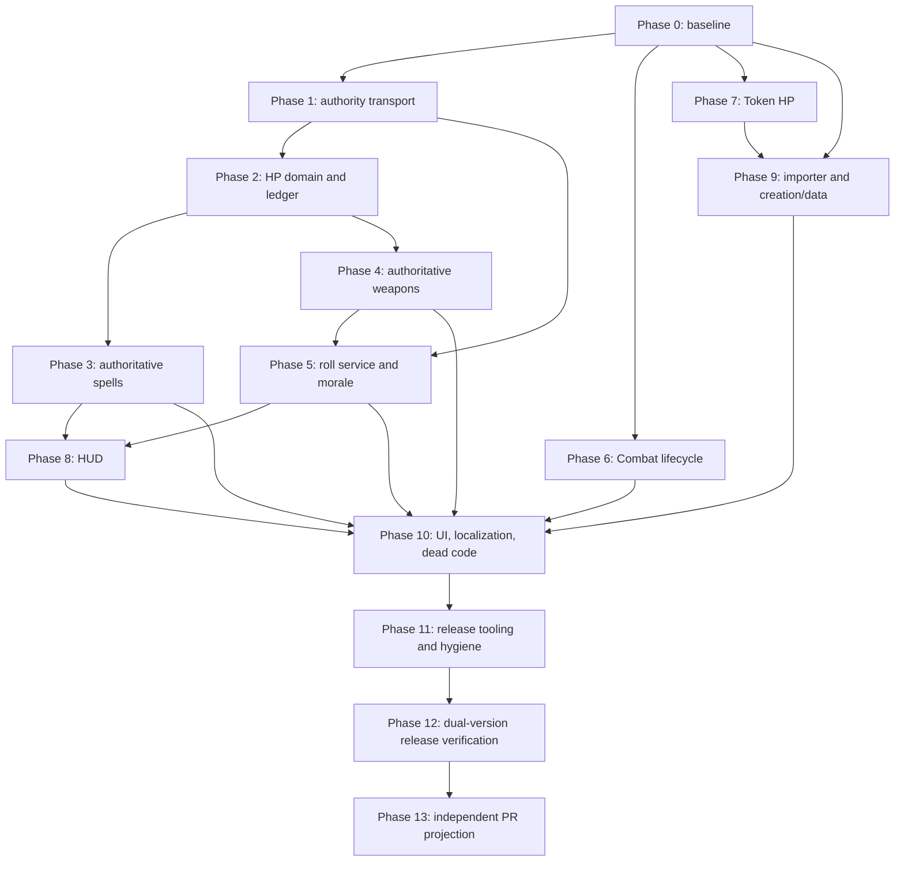

# Swords & Wizardry Remediation Implementation Plan

- Status: approved for implementation
- Plan date: 2026-08-30
- Decision acceptance date: 2026-08-30
- Local implementation baseline: `dev` at `e20c70ce748d08f644830cee5243f451619449e5`
- Integration branch: `dev` contains all approved production fixes
- Upstream delivery: several independent PR branches
- Technical design: [`SW_FIXES_DESIGN.md`](SW_FIXES_DESIGN.md)
- Source findings: [`CODE_REVIEW.md`](CODE_REVIEW.md)
- Target runtimes: Foundry VTT 13.351 and 14.367

## 1. Objective

Implement and prove the remediations for SW-01 through SW-16 without changing Swords & Wizardry rules, exposing live-world data, or widening the upstream pull request with local development artifacts.

The work is complete only when:

- shared damage, healing, prepared-spell consumption, and hidden morale operations are authorized and executed exactly once by the active GM;
- weapon and spell workflows preserve source and target identity across clients and synthetic Actors;
- Combat and Token lifecycle code follows Foundry's documented v13/v14 behavior;
- import and character creation operations either complete coherently or leave no partial Documents;
- legacy UI, data models, and release contents meet the design acceptance criteria;
- the same release-shaped archive passes static, unit, integration, diagnostic, and Playwright gates on Foundry 13.351 and 14.367; and
- `dev` contains all approved production fixes; and
- each upstream-facing PR branch contains one approved, independently reviewable production change set and matches the upstream repository structure.

This plan implements the decisions in `SW_FIXES_DESIGN.md`; it does not replace or reinterpret that document.

## 2. Execution constraints

### 2.1 Repository boundaries

- Modify only the writable `swords-wizardry` repository. Treat `References/` and portable Foundry application directories as read-only.
- Never run automated tests against the live Foundry user-data directory.
- Keep disposable runtime data under the workspace `RuntimeTests/v13/` and `RuntimeTests/v14/` paths.
- Do not publish, deploy to the live installation, push, open a pull request, or delete branches unless the maintainer explicitly requests that action.
- Preserve unrelated working-tree changes. At plan creation, `CODE_REVIEW.md`, `SW_FIXES_DESIGN.md`, and this implementation plan are untracked; they must not be overwritten or accidentally omitted from local backups.

### 2.2 Local validation, `dev`, and upstream PR history

The current `dev` branch contains the desired Spell Effects work and local test/documentation infrastructure. Its intended end state is the integration branch containing all approved production fixes. Its local `upstream/dev` ref is an old branch and is not a suitable PR base. The current upstream default ref is `upstream/main`, but it must be fetched and revalidated immediately before creating each upstream-facing branch.

Use three coordinated histories:

1. **Local validation history:** preserve Node tests, Foundry diagnostics, Playwright code, implementation notes, and runtime evidence in a local-only branch/worktree. Keep it synchronized with production changes from `dev`, but never use it as an upstream PR base.
2. **`dev` integration history:** place every approved production fix on `dev`. Its checked-out tree should retain the upstream-style production structure and exclude local-only tests, internal design documents, compatibility evidence, Playwright artifacts, and disposable runtime data before it is pushed.
3. **Independent upstream PR histories:** create each PR branch from the freshly fetched, then-current upstream default. Project only the coherent production commits for that PR. Never base a PR on another unmerged PR branch and never merge the local validation history wholesale.

For each implementation slice, prefer paired commits:

- `test: cover <behavior>` — local test or diagnostic changes;
- `fix: <behavior>` — production changes that can be projected to the PR branch.

If a production commit necessarily changes a package/build file, keep that change in the production commit. Apply every production commit to `dev`. Local-only tests, internal design documents, compatibility evidence, test runners, and disposable data stay in the local validation history and out of `dev` and upstream-facing branches.

Before presenting each PR branch, compare it with the freshly fetched upstream default and confirm that its top-level shape contains no new `tests/`, internal `docs/`, `RuntimeTests/`, Playwright reports, or internal design files. Repeat the same shape check on `dev` before pushing it.

### 2.3 Test-first and review rules

- Start each non-trivial behavior with a failing test that proves the reported defect or security boundary.
- Implement the smallest change that passes that test. Do not combine unrelated cleanup with a behavior fix.
- Run focused tests after each task, `npm run check` at each phase exit, and a focused real-Foundry test for every Foundry API boundary.
- Never remove the old RPC or custom ChatMessage override until every caller has moved and parity tests pass. Conversely, never ship a build containing both a reachable legacy mutation path and the new authority path.
- Treat unexpected deprecations, console errors, page errors, failed requests, duplicate hooks, and leaked server processes as failures.
- Keep serialized request/message schemas versioned. Reject unknown fields and future versions.
- Record exact Foundry build, archive checksum, system version, browser version, test result, and evidence location for every release-candidate run.

### 2.4 Status vocabulary

Use these values when executing the checklist:

- `not-started`
- `in-progress`
- `blocked`
- `implemented`
- `verified-v13`
- `verified-v14`
- `complete`

Do not mark a phase complete merely because its Node tests pass; use the stated phase exit gate.

## 3. Accepted decisions

The maintainer accepted DG-01 through DG-05 on 2026-08-30. They are implementation requirements, not remaining questions.

| Gate | Accepted disposition | Execution consequence | Status |
| --- | --- | --- | --- |
| DG-01 | Remove the unreachable Active Effect helper/template/SCSS after proving no runtime consumer. | Delete the dead UI code in Phase 10. Preserve `CONFIG.ActiveEffect.legacyTransferral` unless separate evidence proves it unused. | Accepted 2026-08-30 |
| DG-02 | Retain self-service character creation only for users with `ACTOR_CREATE`; creator receives OWNER, everyone else defaults to NONE. | Implement the permission and ownership contract in Phase 9. | Accepted 2026-08-30 |
| DG-03 | Display historical player-authored spell/weapon cards, disable mutation controls, and offer a localized repost/reroll notice. | Do not trust, migrate, or reactivate historical flags. | Accepted 2026-08-30 |
| DG-04 | Use several independent upstream PRs, while `dev` contains all production fixes. | Each PR starts from the then-current upstream default. A dependent group waits for its prerequisite to merge instead of stacking on an open PR. | Accepted 2026-08-30 |
| DG-05 | Report existing negative quantity/weight source values through a GM diagnostic; do not mutate worlds automatically. | Add an explicit repair only if real world data later demonstrates need and the maintainer separately approves it. | Accepted 2026-08-30 |

If implementation evidence contradicts an accepted premise—for example, a real Active Effect consumer is discovered—stop that task and return to the maintainer instead of forcing the accepted disposition onto different facts.

## 4. Dependency map



Phases 6 and 7 may be implemented in either order after Phase 0. Do not begin Phase 8 until the spell and roll service entry points are stable. Do not prepare the upstream-facing branch until the release candidate has passed both generations.

## 5. Phase 0 — Establish the reproducible baseline

Addresses infrastructure required by all findings.

### P0-01 — Preserve and record repository state

Status: `not-started`

Actions:

1. Record `git status --short`, current branch, HEAD, remotes, and local upstream refs.
2. Back up or otherwise preserve the untracked review/design/plan files without adding them to the upstream-facing history.
3. Fetch remotes only when authorized and record the exact upstream default commit. Do not assume `upstream/dev` is current.
4. Preserve the current complete development state in a local-only validation branch/worktree before changing tracked test/documentation boundaries.
5. Keep `dev` as the production integration branch and apply every approved production-fix commit to it.
6. Move local-only tests, diagnostics, internal documents, and evidence out of the `dev` tip without deleting the local validation copies. Prefer forward commits; do not rewrite published history unless separately authorized.
7. Do not clean or reset the existing `dev` branch while establishing these boundaries.

Evidence:

- baseline commit and status in local run notes;
- exact upstream default ref and commit after fetch; and
- no reference or live user-data paths inside the Git worktree.

### P0-02 — Prove the existing fast suite before modifying behavior

Status: `not-started`

Run:

```powershell
npm ci
npm run check
npm run package
```

Record:

- Node/npm versions;
- existing test counts;
- package file count and SHA-256;
- existing warnings and deprecations; and
- any failure that predates the remediation.

Do not weaken assertions or add an allowlist simply to make the baseline green.

### P0-03 — Create shared test fixtures

Status: `not-started`

Add local-only fixtures/helpers:

- `tests/helpers/foundry-fixtures.mjs` — Actor, Item, Token, ChatMessage, User, Hooks, and socket-shaped fakes;
- `tests/helpers/fake-clock.mjs` — deterministic timeouts and request expiry;
- `tests/helpers/request-ids.mjs` — deterministic unique request IDs;
- `tests/helpers/faults.mjs` — injected failures before/after each write boundary; and
- `tests/helpers/runtime-matrix.mjs` — version-shaped v13/v14 fixtures without hiding behavioral differences.

Fixture rules:

- no production module may import from `tests/`;
- return independent objects for every test;
- represent world Actors and unlinked Token synthetic Actors distinctly;
- permit two GM clients and one player to share a fake transport; and
- count hooks, listeners, timers, writes, and messages.

Phase 0 exit gate:

- baseline results are recorded;
- shared fixtures have self-tests;
- no production behavior changed; and
- `npm run check` and `npm run package` pass or a pre-existing blocker is documented.

Suggested local commits:

- `test: add deterministic Foundry service fixtures`

## 6. Phase 1 — Establish the authenticated authority transport

Implements WP-01 and begins SW-01, SW-07, and SW-10.

### A1-01 — Define the strict authority domain

Status: `not-started`

Create:

- `module/authority/domain.mjs`
- `tests/unit/authority/domain.test.mjs` (local-only)

Implement pure functions for:

- request/response envelope validation;
- schema version 1;
- exact-field rejection;
- 16–64 character request IDs;
- maximum serialized request/payload sizes;
- UUID, operation, collection-length, numeric, and choice validation;
- stable result statuses/error codes; and
- creation of envelopes where caller-supplied payload can never overwrite transport fields.

Test first:

- malformed, oversized, unknown-field, unknown-operation, and future-version envelopes;
- spoofed `userId` fields;
- invalid IDs/UUIDs and unsafe numbers;
- valid request/response round trips; and
- frozen/immutable operation definitions.

Focused command:

```powershell
node --test tests/unit/authority/domain.test.mjs
```

### A1-02 — Implement the native system-socket adapter

Status: `not-started`

Create:

- `module/authority/system-socket.mjs`
- `tests/integration/authority/system-socket.test.mjs` (local-only)

Required behavior:

- one listener on `system.swords-wizardry`;
- `start()` and `stop()` are idempotent;
- use the native listener's second argument as authenticated sender ID;
- dispatch only through a fixed operation registry;
- only `game.users.activeGM` handles requests;
- recheck `game.user.isActiveGM` immediately before handler writes;
- resolve only the intended recipient's pending response;
- use a ten-second timeout with deterministic cleanup;
- retain a bounded completed-request cache or persisted operation result for retries; and
- never include roll totals, target HP, or secrets in responses.

Fault tests:

- two GMs receive one request but only the active GM handles it;
- sender ID differs from a spoofed payload ID;
- response is lost and retry returns the prior result;
- timeout, stop, handler failure, and socket replacement clear pending state; and
- active-GM change before a write fails closed or redispatches without duplicate mutation.

### A1-03 — Compose the service without routing mutations yet

Status: `not-started`

Modify `module/swords-wizardry.mjs`:

- construct the socket adapter and empty/explicit operation registry in the composition root;
- start it during `ready`;
- retain hook/listener handles needed for teardown;
- expose only narrow service APIs through `game.swordswizardry`; and
- remove the ad hoc socket console branch once the new adapter receives all package messages.

Do not remove `module/helpers/rpc.mjs` in this task. It remains temporarily reachable only by legacy weapon/morale code and therefore this intermediate state is not releasable.

Phase 1 exit gate:

- focused authority tests pass;
- lifecycle stress tests show one listener and zero leaked pending timers after stop;
- a real v13 and v14 diagnostic proves the second listener argument is the authenticated sender ID; and
- `npm run check` passes.

Suggested paired commits:

- `test: define authority transport contract`
- `fix: add active-GM system socket adapter`

Release state: **DO NOT SHIP** while the legacy RPC remains reachable.

## 7. Phase 2 — Build the common HP domain and write-ahead ledger

Implements the shared part of WP-02 and SW-01, SW-06, and SW-07.

### H2-01 — Extract deterministic HP calculations

Status: `not-started`

Create:

- `module/hit-points/domain.mjs`
- `tests/unit/hit-points/domain.test.mjs` (local-only)

Move/generalize the tested behavior currently in `module/spells/domain.mjs`:

- damage/healing amount normalization;
- full, half-floor, double, and healing modes;
- clamp to `[0, max]`;
- deterministic application ID based on result message and target UUID;
- source/action and target-state fingerprints;
- pending/applied/failed/conflict ledger transitions; and
- recovery classification from current target state versus recorded before/after state.

Boundary tests must include zero, maximum HP, odd half damage, amounts above maximum, non-finite values, maximum safe integer constraints, deleted targets, modified timestamps, and synthetic Actor identity.

### H2-02 — Define authoritative result adapters

Status: `not-started`

Create:

- `module/hit-points/result-adapters.mjs`
- `tests/unit/hit-points/result-adapters.test.mjs` (local-only)

Adapters must:

- read only active-GM-authored schema-versioned spell/weapon result messages;
- normalize them to the capability shape in the design;
- validate source Actor/Item UUIDs, action fingerprint, amount, target UUID list, allowed modes, and ledger schema;
- reject player-authored messages, unknown/future schemas, arbitrary flags, unsupported modes, and legacy messages; and
- return structured failures rather than notices.

Do not assume ChatMessage flags are immutable. Re-resolve the message and validate author/flags immediately before every application attempt.

### H2-03 — Implement the active-GM application service

Status: `not-started`

Create:

- `module/hit-points/application-service.mjs`
- `tests/integration/hit-points/application-service.test.mjs` (local-only)

Register `hitPoints.apply` with the authority operation map.

Write order for one target:

1. authenticate the sender and require GM for manual requests;
2. resolve and validate the authoritative result message;
3. validate that the requested target/mode is allowlisted;
4. derive a deterministic application ID;
5. re-resolve the Token/Actor and capture its before fingerprint;
6. write a pending ledger entry to the result message;
7. re-resolve and compare the target fingerprint;
8. perform one awaited Actor update;
9. write the applied ledger entry with after fingerprint; and
10. return a safe structured result.

Recovery behavior:

- target at before state: retry the Actor update;
- target at after state: finalize the ledger without another HP update;
- any other state: record/report conflict and do not guess;
- audit finalization failure: leave recoverable pending state and never restore an old HP value blindly.

Fault-injection tests must fail each numbered boundary and verify write count, ledger state, and final HP. Add concurrent manual/automatic, duplicate-click, lost-response, deleted-target, unlinked-Token, and active-GM failover cases.

### H2-04 — Add generic HP rendering data, not generic HTML listeners

Status: `not-started`

Keep display data in adapters/services and interaction in the spell/weapon controllers. Do not reintroduce a global custom ChatMessage subclass for common buttons.

Test that:

- players never receive remaining HP;
- all applied/duplicate/conflict states can render from persisted flags after reload; and
- application controls are derived from permission, setting, authoritative status, target entry, and prior application—not from hidden CSS alone.

Phase 2 exit gate:

- every HP domain and fault-injection test passes;
- the application service performs no roll evaluation and accepts no caller-supplied HP value;
- synthetic Actor tests resolve through stable TokenDocument UUIDs; and
- `npm run check` passes.

Suggested paired commits:

- `test: define HP capability and recovery state machine`
- `fix: add authoritative HP application service`

Release state: **DO NOT SHIP** until spell and weapon callers have migrated and the legacy RPC is removed.

## 8. Phase 3 — Migrate Spell Effects and prepared-spell consumption

Implements WP-03 and the spell half of WP-02; completes the spell portions of SW-05 and SW-07.

### S3-01 — Freeze the versioned spell message contract

Status: `not-started`

Modify:

- `module/spells/constants.mjs`
- `module/spells/domain.mjs`
- `tests/unit/spells/domain.test.mjs`

Actions:

- bump the spell message schema when the final serialized shape is frozen;
- distinguish non-authoritative post cards, pending cast cards, and active-GM-authored HP result messages;
- add source Item/Actor UUID and action fingerprint validation;
- keep non-HP effects local and explicitly non-authoritative; and
- classify legacy/player-authored result cards as readable but not actionable.

### S3-02 — Route damage/healing result creation through the active GM

Status: `not-started`

Modify:

- `module/spells/service.mjs`
- `module/spells/application.mjs` (then remove or reduce it to a compatibility facade)
- `module/spells/chat-controller.mjs`
- `module/templates/spells/action-result.hbs`
- existing spell service/controller tests

Register `spell.hitPointResult`.

The active GM must:

- derive requester identity from the socket;
- resolve the posted card, source Item, source Actor, and snapshotted targets;
- require requester OWNER permission for the real source;
- compare current normalized action fingerprint with the card snapshot;
- resolve/validate prompted caster level;
- evaluate the real Foundry Roll;
- create the authoritative result message; and
- automatically invoke the common HP service exactly once when `dmAppliesDamage` is unchecked.

Manual mode must show enabled Apply controls only to GMs. Preserve spell damage modes and spell-healing behavior defined in the design.

Regression tests:

- caster-level dice formulas;
- damage/healing with no braces workaround regression;
- selected, self, and no-target modes;
- save outcomes and attack-gated spell effects;
- all roll modes;
- source Item edited/deleted after posting;
- forged message flags; and
- repeated rendering or button clicks.

### S3-03 — Make consumption authoritative and recoverable

Status: `not-started`

Register `spell.consume` and modify `module/spells/service.mjs`.

Implement the card-backed pending/consumed/failed state machine from the design. The request payload contains only the card UUID. The active GM verifies author, ownership, prepared list, source fingerprint, and exactly one occurrence before writing.

Add integration tests for:

- final prepared copy cast concurrently by two owner clients;
- duplicated spell IDs in the prepared list;
- lost response and retry;
- failover before Actor update and before audit finalization;
- stale preparation and deleted Item/Actor;
- plain post without an active GM; and
- cast failing closed when no active GM exists.

### S3-04 — Preserve card layout, theme, and controller behavior

Status: `not-started`

Update spell templates/SCSS only where new persisted states require it. Retain the approved weapon-like outlined result layout and readable inherited typography. Do not reintroduce forced bold text or hard-coded light/dark colors.

Extend:

- `tests/unit/spells/card-layout.test.mjs`
- `tests/integration/spells/chat-controller.test.mjs`
- `tests/foundry/spell-diagnostics/diagnostics.mjs`
- `tests/e2e/spell-cards.spec.mjs`

Phase 3 exit gate:

- existing Spell Effects tests remain green;
- forged player result cards cannot mutate HP;
- spell damage, healing, and consumption pass focused v13/v14 GM/player/second-GM tests;
- automatic/manual setting behavior matches the current user-visible contract; and
- `npm run check` passes.

Suggested paired commits:

- `test: cover authoritative spell results and consumption`
- `fix: route spell HP results through active GM`
- `fix: make prepared spell consumption recoverable`

## 9. Phase 4 — Replace the legacy weapon workflow

Implements the weapon half of WP-02 and completes SW-01 and SW-06.

### W4-01 — Define immutable weapon plans

Status: `not-started`

Create:

- `module/weapons/domain.mjs`
- `tests/unit/weapons/domain.test.mjs` (local-only)

Test and implement:

- ascending and descending attack math;
- formula/modifier validation;
- stable source and target snapshot normalization;
- deterministic hit-target filtering;
- linked and unlinked source/target UUIDs;
- empty/deleted targets; and
- escaped display-only special-damage text.

### W4-02 — Implement authoritative weapon attack/damage services

Status: `not-started`

Create:

- `module/weapons/service.mjs`
- `module/weapons/chat-controller.mjs`
- `module/templates/weapons/attack-result.hbs`
- `module/templates/weapons/damage-result.hbs`
- `tests/integration/weapons/service.test.mjs` (local-only)
- `tests/integration/weapons/chat-controller.test.mjs` (local-only)

Register `weapon.attack` and `weapon.damage`.

Rules:

- attack request contains source Item UUID and bounded target UUID list;
- active GM validates requester ownership and evaluates the attack;
- attack message persists source, target snapshots, settings inputs, and hit outcomes;
- damage request contains only trusted attack message UUID;
- changing currently selected targets cannot change damage eligibility;
- damage result is active-GM-authored and feeds the common HP service;
- manual controls remain Damage, Half, Double, and Healing; and
- automatic application remains full damage only.

### W4-03 — Migrate every weapon entry point

Status: `not-started`

Modify:

- `module/item/item.mjs`
- `module/actor/actor.mjs` where weapon entry points remain
- `module/rolls/rolls.mjs`
- `module/swords-wizardry.mjs`
- related templates/localization

Actor sheet, Item sheet, HUD, macro, and direct `Item.roll()` paths must converge on `WeaponService`. Add one integration assertion for each entry point.

### W4-04 — Disable old cards and remove the unsafe path

Status: `not-started`

After parity is proven:

1. render old weapon cards as display-only with a localized reroll notice;
2. remove imports/callers of `rpc`;
3. remove `module/helpers/rpc.mjs`;
4. remove `SwordsWizardryChatMessage` registration;
5. remove `module/helpers/overrides.mjs` after no imports remain; and
6. prove by `rg` and runtime tests that no generic Actor-update socket operation exists.

Required checks:

```powershell
rg -n "helpers/rpc|handleRPC|operation.*damage|SwordsWizardryChatMessage|helpers/overrides" module
npm run check
```

Phase 4 exit gate:

- weapon linked/unlinked, changed-selection, duplicate, automatic/manual, and forged-message tests pass on v13/v14;
- no production import or socket handler references the legacy RPC or override;
- old cards are readable but cannot mutate; and
- `npm run check` passes.

Suggested paired commits:

- `test: cover authoritative weapon attack and damage`
- `fix: preserve weapon identity through active-GM service`
- `fix: remove legacy damage RPC and ChatMessage override`

This is the first potentially shippable security boundary, subject to the Phase 12 runtime matrix.

## 10. Phase 5 — Normalize roll orchestration and hidden morale

Implements WP-06 and SW-04/SW-10.

### R5-01 — Extract the v13/v14 chat visibility adapter

Status: `not-started`

Move `applyFoundryChatVisibility` from `module/spells/service.mjs` to a focused shared adapter, preferably `module/rolls/chat-visibility.mjs`, and cover public, GM, blind, and self roll modes with v13/v14-shaped fixtures.

### R5-02 — Separate calculation from message orchestration

Status: `not-started`

Create/modify:

- `module/rolls/service.mjs`
- `module/rolls/rolls.mjs`
- `module/actor/actor.mjs`
- `module/item/item.mjs`
- `tests/unit/rolls/domain.test.mjs` (local-only)
- `tests/integration/rolls/service.test.mjs` (local-only)

Roll subclasses may calculate but must not own source lookup, authority, or message lifecycle. The service receives real Actor/Item Documents, builds serializable roll data, evaluates, and creates a message with the correct speaker.

Test saves, formula features, whitespace/blank features, invalid formulas, uncontrolled Token cases, deleted source, and each roll mode. A blank feature posts one enriched description message and never calls itself recursively.

### R5-03 — Route hidden morale through the active GM

Status: `not-started`

Register `morale.roll`.

- GM callers evaluate directly through the same handler.
- Player callers send only the NPC UUID.
- Active GM re-resolves the NPC, verifies OWNER permission, evaluates, and creates a GM-only message.
- The response contains no formula, total, or success value.

Add spoofed sender, no active GM, unauthorized NPC, two-GM, and lost-response cases.

Phase 5 exit gate:

- no recursive feature path exists;
- every roll has correct Actor/Token speaker without relying on selected Tokens;
- hidden morale content is absent from the player response/DOM; and
- focused v13/v14 diagnostics and `npm run check` pass.

Suggested paired commits:

- `test: cover roll speakers, blank features, and hidden morale`
- `fix: centralize roll and chat visibility orchestration`

## 11. Phase 6 — Repair Combat lifecycle and side initiative

Implements WP-04 and SW-02.

### C6-01 — Lock current rules behavior in pure tests

Status: `not-started`

Create `tests/unit/combat/side-initiative.test.mjs` for disposition grouping, stable update planning, empty Combat, and tie behavior as currently intended. Do not alter side initiative rules.

### C6-02 — Restore the parent update lifecycle

Status: `not-started`

Modify `module/combat/combat.mjs` and add `tests/integration/combat/combat.test.mjs`.

- make `_onUpdate(changed, options, userId)` synchronous;
- call `super._onUpdate` first with the exact arguments;
- run only guarded presentation work synchronously;
- schedule async side work without returning a Promise to an unawaited hook/lifecycle caller;
- protect round processing with a system-owned option sentinel; and
- guard sheet/canvas/token operations against missing, deleted, inactive, or non-viewed state.

### C6-03 — Make side initiative one authoritative batch

Status: `not-started`

Implement `rollSideInitiative()`:

- require active GM;
- evaluate one party and one opponent `1d6` Roll;
- plan all Combatant updates before writing;
- perform one awaited embedded-document update;
- set turn zero once; and
- create one localized public message containing both Rolls.

Real Foundry tests must verify core tracker state, current/previous state, turn hooks, token markers, sounds, empty/deleted Combat, and two-GM behavior on v13/v14.

Phase 6 exit gate:

- parent lifecycle spy and real Foundry lifecycle tests pass;
- advancing a round creates one initiative pair/message/update batch; and
- `npm run check` passes.

Suggested paired commits:

- `test: capture Combat lifecycle and side initiative behavior`
- `fix: restore core Combat lifecycle and batch side initiative`

## 12. Phase 7 — Persist unlinked NPC Token HP during creation

Implements WP-05 and SW-03.

### T7-01 — Extract and test the HD grammar

Status: `not-started`

Create:

- `module/tokens/hit-dice.mjs`
- `tests/unit/tokens/hit-dice.test.mjs` (local-only)

Accept only `N`, `NdM`, and either form with one integer `+K` or `-K`, with surrounding whitespace. Convert bare `N` to `Nd8`. Reject empty, zero/negative dice, fractions, multiple modifiers, unsafe integers, arbitrary roll terms, and trailing text.

### T7-02 — Move HP generation into `_preCreate`

Status: `not-started`

Modify `module/tokens/token.mjs` and add `tests/integration/tokens/token.test.mjs`.

- call `super._preCreate` first;
- require active GM/authorized creation context;
- use `this.baseActor` for NPC type and HD;
- skip linked Tokens and Actors with nonzero base HP maximum;
- validate/evaluate exactly one Roll;
- require positive safe-integer total; and
- call `this.updateSource({delta: {system: {hp: {max, value}}}})` before creation.

Invalid HD leaves inherited HP unchanged and raises one localized GM warning.

Phase 7 exit gate:

- v13/v14 real Foundry checks prove HP exists in Token source ActorDelta and survives reload;
- two GMs cause one roll;
- linked Tokens do not modify the base Actor; and
- `npm run check` passes.

Suggested paired commits:

- `test: define NPC hit-dice parsing and Token persistence`
- `fix: roll unlinked NPC HP in Token pre-create`

## 13. Phase 8 — Rebuild the Combat HUD on stable services

Implements WP-07 and SW-05/SW-11. Depends on Phases 3–5.

### U8-01 — Capture HUD lifecycle failures

Status: `not-started`

Create:

- `tests/integration/hud/hud.test.mjs` (local-only)
- focused Playwright HUD scenarios

Prove the pre-fix cases: repeated render bindings, two controlled Tokens, deselecting one Token, Token deletion, Scene change, close with a scheduled render, and spell casting from the HUD.

### U8-02 — Use declared ApplicationV2 actions

Status: `not-started`

Modify:

- `module/hud/hud.mjs`
- `module/hud/hud.hbs`
- HUD SCSS/localization
- `module/swords-wizardry.mjs` hook composition

Implementation:

- declare `DEFAULT_OPTIONS.actions`;
- use native buttons;
- call Actor/Item/Spell services only;
- remove direct prepared-array and other Document mutations;
- key instances by TokenDocument UUID in a module-owned `Map`;
- reconcile the complete controlled-token UUID set on every control change;
- close on deselection, deletion, Scene/canvas teardown, and application close;
- register/remove hooks exactly once;
- coalesce update bursts and invalidate stale scheduled renders; and
- clamp placement to the viewport.

Phase 8 exit gate:

- repeated renders produce one action per click;
- two selected Tokens maintain exactly two correctly bound HUDs;
- HUD spell cast uses authoritative consumption and survives reload;
- close/Scene teardown leaves zero hooks, listeners, timers, and HUD instances; and
- keyboard/accessibility plus constrained viewport Playwright tests pass on v13/v14.

Suggested paired commits:

- `test: cover multi-token HUD lifecycle`
- `fix: rebuild Combat HUD with ApplicationV2 actions`

## 14. Phase 9 — Make import and creation/data updates coherent

Implements WP-08, WP-09, WP-11 and SW-08/SW-09/SW-13.

### I9-01 — Build a pure stat-block parser

Status: `not-started`

Create:

- `module/importer/domain.mjs`
- `tests/unit/importer/domain.test.mjs` (local-only)
- deterministic valid/malformed fixture files under `tests/unit/importer/fixtures/` (local-only)

Implement the bounded input, label parsing, `CL/XP`, shared HD grammar, complete attack-group parsing, unknown-text preservation, and immutable complete-plan/error result specified in the design. The domain must make no Foundry calls.

### I9-02 — Use one importer mutation boundary

Status: `not-started`

Modify `module/importer/importer.mjs` and `module/importer/importer.hbs`; add `tests/integration/importer/importer.test.mjs`.

- require GM at render and submit;
- validate complete Actor/embedded Item sources before writing;
- prefer one `Actor.create` containing embedded items after real v13/v14 confirmation;
- otherwise compensate only the newly created Actor if one batch embedded write fails;
- never create temporary world Items;
- disable repeat submit; and
- keep dialog open with localized field errors on failure.

### D9-01 — Correct model field constraints and zero handling

Status: `not-started`

Modify:

- `module/item/item-model.mjs`
- `module/actor/actor-model.mjs`
- `module/actor/actor.mjs`
- affected sheet submission code
- existing/new model tests

Changes:

- `minimum` → `min`;
- `intitial` → `initial`;
- quantity/weight required integer non-null min zero initial one;
- zero quantity contributes zero weight;
- property-presence logic for tHAACB/tHAC0 and AC/AAC; and
- reject inconsistent simultaneous derived-pair updates.

Add a read-only GM diagnostic for existing negative source values. Do not add an automatic migration.

### D9-02 — Enforce the character-creation permission contract

Status: `not-started`

Modify:

- `module/character-creator/character-creator.mjs`
- `module/character-creator/character-creator.hbs`
- localization
- `tests/unit/character-creator/domain.test.mjs` (local-only)
- `tests/integration/character-creator/service.test.mjs` (local-only)

Require `game.user.can('ACTOR_CREATE')` at button render and submit, validate trimmed name/folder, await all Rolls, use explicit modern ownership, use package-relative images, disable while pending, and close only on successful creation.

Phase 9 exit gate:

- importer parse/create failure leaves Actor and world Item counts unchanged;
- quantity/weight and derived-field boundary tests pass;
- permitted player owns the new Actor while unrelated players do not;
- denied player cannot invoke the handler directly; and
- real v13/v14 creation/import diagnostics plus `npm run check` pass.

Suggested paired commits:

- `test: cover importer plans and atomic creation`
- `fix: validate stat blocks before creating Documents`
- `test: cover model boundaries and character permissions`
- `fix: correct data constraints and character ownership`

## 15. Phase 10 — Remove dead code and finish UI/localization quality

Implements WP-10/WP-13 and SW-12/SW-15.

### Q10-01 — Prove Active Effect code is unreachable

Status: `not-started`

Before deletion:

```powershell
rg -n "onManageActiveEffect|prepareActiveEffectCategories|effects\.hbs|_effects" module templates
npm run check:syntax
npm run check:templates
```

Run v13/v14 Actor/Item sheet smoke tests and record whether any effect controls or callbacks appear. DG-01 already authorizes removal if this proof confirms there is no consumer. Stop and return to the maintainer only if a real consumer is discovered.

After the no-consumer proof, remove:

- `module/helpers/effects.mjs`;
- `module/actor/effects.hbs`;
- `module/scss/components/_effects.scss`;
- their template preload/imports; and
- no-longer-relevant effect action localization.

Do not remove `CONFIG.ActiveEffect.legacyTransferral = false` merely because the UI helper is dead; first verify whether transferred Item effects still rely on that system behavior.

### Q10-02 — Complete localization

Status: `not-started`

Modify all three locale files and `scripts/check-localization.mjs` locally as needed.

Cover settings, importer, character creator, Combat/initiative, HUD, roll errors, authority errors, stale/legacy card notices, and macro notices. Controllers consume structured service errors and localize them; domain/services do not format UI notices.

Require exact key parity across English, German, and Spanish or an explicitly documented fallback policy accepted by the maintainer. No user-visible English literals remain in touched workflows.

### Q10-03 — Accessibility, theme, and route-prefix cleanup

Status: `not-started`

In touched templates/SCSS:

- replace action anchors with native buttons;
- add accessible names and hidden decorative icons;
- preserve `:focus-visible` and disabled semantics;
- scope broad CSS beneath system-owned roots;
- inherit Foundry/theme colors;
- remove leading `/` from package asset/font URLs;
- remove unused Google Roboto import;
- remove production `{{log}}` helpers and unconditional object/socket dumps; and
- retain only a setting-gated prefixed debug logger.

Playwright coverage must include keyboard activation/focus, default and Carolingian themes, light/dark appearance, 1440×900 and 800×600 viewports, and non-root route prefix asset requests.

Phase 10 exit gate:

- dead files are removed only after approval and proof;
- localization/template/static checks pass;
- no touched control lacks an accessible name or keyboard behavior;
- no package asset fails under a route prefix; and
- v13/v14 sheet/chat/HUD smoke tests have no new console/deprecation errors.

Suggested paired commits:

- `test: cover localization, accessibility, themes, and routes`
- `fix: remove unreachable effect UI and complete UI quality fixes`

## 16. Phase 11 — Build the release gate and clean package boundaries

Implements WP-12/WP-14 and SW-14/SW-16.

### G11-01 — Separate package creation from runtime verification

Status: `not-started`

Modify local development tooling:

- `package.json`
- `playwright.config.mjs`
- `scripts/package-system.mjs`
- add a Windows verification runner under `scripts/`
- extend the Foundry diagnostic and Playwright suites

Canonical commands:

```text
npm run check           static + unit + integration + template + build
npm run package         check, then create one allowlisted archive
npm run test:e2e        test an already running disposable runtime
npm run verify:release  package once, install that archive into v13/v14, test both
```

The verification runner must discover portable installations, launch each `App/resources/app/main.mjs` as a headless Node child process, use explicit ports and isolated data, wait for a positive health signal, run diagnostics/Playwright, terminate the exact process in `finally`, and verify the port closes.

Never copy or retain licenses, administrator keys, credentials, session data, or live-world content. Redact personal paths from retained/published evidence.

### G11-02 — Expand the real Foundry diagnostic package

Status: `not-started`

Extend the existing diagnostic to create uniquely prefixed fixtures and clean only those fixtures. It must publish structured results per client for:

- authority, sender identity, two-GM execution, duplicate request, and failover;
- linked/unlinked spell/weapon HP flows;
- prepared-spell consumption;
- Token ActorDelta HP;
- rolls, speakers, and hidden morale;
- Combat lifecycle;
- importer/character creation and ownership; and
- deprecations, console/page errors, failed requests, and assets.

The diagnostic must be excluded from the release archive.

### G11-03 — Tighten repository/release hygiene

Status: `not-started`

Modify:

- `.gitignore`
- `release-files.json`
- package validation locally

Actions:

- ignore `*~`, `*.map`, `RuntimeTests/`, and local evidence outputs;
- remove tracked `module/tokens/token.mjs~` and `css/swords-wizardry.css.map` from the production history;
- remove `docs/` from the release allowlist;
- retain only explicitly allowed root user documentation;
- keep the current icon library for backward path compatibility;
- add archive file-count/size warnings;
- assert no tests, internal docs, scripts, source maps, backups, credentials, or unexpected large files enter the archive; and
- prove two builds from identical source have identical SHA-256 checksums.

The upstream-facing branch should not gain local testing directories merely because local tooling was expanded. Only production-facing package/build metadata explicitly approved for upstream belongs there.

Phase 11 exit gate:

- clean local package command produces the deterministic allowlisted archive;
- archive shape/manifest-reference tests pass;
- local tests/tooling/evidence are absent from the archive;
- no test process remains running; and
- `npm run check` and two consecutive `npm run package` runs pass with identical archive hashes.

Suggested paired commits:

- `test: enforce release archive boundaries`
- `build: add dual-version release verification`
- `chore: remove backups and source maps from production history`

## 17. Phase 12 — Execute the v13/v14 release-candidate matrix

Completes the runtime proof for all findings.

### V12-01 — Freeze one candidate artifact

Status: `not-started`

1. Require a clean intended source state.
2. Run `npm ci` and `npm run package` once.
3. Record archive SHA-256 and included file manifest.
4. Copy the same archive—not a rebuilt archive or symlink—to both isolated runtime data directories.

### V12-02 — Run the shared matrix

Status: `not-started`

For Foundry 13.351 and 14.367, run:

- GM, player, and inactive/second-GM clients;
- weapon authority with linked/unlinked sources/targets and changed selection;
- automatic/manual spell damage, spell healing, weapon damage, all manual modes, duplicate clicks, and forged flags;
- active-GM failover and pending-operation recovery;
- Combat start/round/turn/delete and side initiative;
- multi-Token HUD lifecycle and concurrent final prepared-spell casting;
- NPC Token HP creation/reload;
- save/feature/morale speaker and visibility behavior;
- importer success/failure counts and character ownership;
- keyboard, focus, accessibility, theme, constrained viewport, and route-prefix scenarios; and
- system enable/reload/disable plus manifest asset discovery.

### V12-03 — Review evidence and classify failures

Status: `not-started`

For each generation, retain beneath its isolated runtime root:

- exact core/system/browser versions;
- candidate checksum;
- structured diagnostic results;
- server log;
- Playwright report/trace/screenshots on failure;
- console/page/request/notification failures; and
- fixture cleanup result and verified closed port.

Classify failures as product, harness, core/dependency, or environment. Reproduce product failures with a focused test before changing production code. Any production fix creates a new artifact checksum and restarts Phase 12 for both generations.

Phase 12 exit gate:

- the same checksum passes every required scenario on both generations;
- no unexpected console/page/deprecation/network failures remain;
- no fixture or server process leaks remain; and
- a dated local compatibility record identifies all evidence.

No live deployment occurs as part of this phase.

## 18. Phase 13 — Prepare independent upstream-facing change sets

This phase occurs only after explicit authorization to prepare branches or PRs. Repeat P13-01 through P13-04 separately for every accepted PR group.

### P13-01 — Refresh and verify the upstream base

Status: `not-started`

- fetch `upstream`;
- inspect its default branch and newest applicable commit;
- confirm the desired PR base with the maintainer if it differs from the current `upstream/main` expectation; and
- create a new PR branch from that upstream commit without modifying `dev` or the local validation history; and
- verify that the new branch is not based on another unmerged PR branch.

### P13-02 — Project only approved production commits

Status: `not-started`

Bring across only the production commits for one accepted PR group. The canonical full set remains on `dev`. Do not merge `dev` or the local validation history wholesale. Resolve against current upstream code rather than overwriting upstream changes.

Allowed categories, subject to actual diff review:

- `module/` runtime code/templates;
- `css/swords-wizardry.css` generated from approved SCSS changes;
- `lang/` localization;
- `system.json`, `package.json`, `package-lock.json`, and release configuration only where required by production/release behavior;
- root user-facing README/changelog/documentation updates approved for the PR; and
- deletion of tracked backup/source-map artifacts.

Excluded categories:

- `CODE_REVIEW.md`, `SW_FIXES_DESIGN.md`, and this implementation plan;
- internal `docs/` and compatibility evidence;
- `tests/`, diagnostic module, Playwright artifacts, and disposable runtime data;
- local-only scripts or credentials; and
- unrelated formatting or asset churn.

### P13-03 — Verify the projected tree, not just the implementation tree

Status: `not-started`

Because local tests are intentionally excluded, test each projected PR branch using the retained local validation harness against its release-shaped artifact.

Required review:

```powershell
git status --short
git diff --check <fresh-upstream-base>...HEAD
git diff --stat <fresh-upstream-base>...HEAD
git diff --name-status <fresh-upstream-base>...HEAD
```

Manually inspect every production diff. Confirm no internal docs/tests/tooling appear, no generated CSS is stale, no manifest path is missing, and no security validation was lost during projection.

Run the applicable fast checks, package the projected tree, and repeat the relevant focused v13/v14 gates. Before presenting the final PR in a dependency chain, run the full Phase 12 matrix against the then-current `dev` integration candidate. A successful test of the local validation or `dev` branch is not evidence for a materially different projected PR branch.

### P13-04 — Present, but do not publish

Status: `not-started`

Report:

- upstream base and branch commit;
- ordered production commits;
- exact changed-file list;
- archive checksum and v13/v14 results;
- excluded local artifacts; and
- known limitations or follow-up work.

Do not push or open/submit any PR until separately requested.

## 19. Accepted independent upstream PR grouping

The maintainer selected several independent PRs, with `dev` retaining the complete set of production fixes. Use these bounded groups:

1. **Authority and HP workflows:** Phases 1–4, including spell/weapon result authority and removal of the unsafe RPC.
2. **Core Foundry lifecycle:** Phases 6–7, including Combat and Token HP. This group has no dependency on PR 1 and may be prepared independently.
3. **Roll services and HUD:** Phases 5 and 8. Wait for PR 1 to merge because the HUD and roll delegation consume its stable services; then branch from the updated upstream default.
4. **Creation and data integrity:** Phase 9 importer, model, and character-creator fixes. If the shared HD parser from PR 2 is required, wait for PR 2 to merge and branch from the updated upstream default.
5. **Quality and release boundaries:** Phases 10–11 runtime-facing localization/accessibility/dead-code/hygiene changes. Prepare after the workflows it touches are merged so the PR contains no duplicated or stacked changes.

An independent PR is based only on an upstream commit, never on another open PR branch. Dependencies are handled by waiting for the prerequisite to merge and then using the new upstream default. Do not split the new authority layer from all mutation callers while leaving the old RPC reachable in a released commit. Continue applying every completed production fix to `dev` regardless of the upstream PR schedule.

## 20. Traceability matrix

| Finding | Implementation tasks | Primary proof |
| --- | --- | --- |
| SW-01 Unauthorized/duplicate RPC | A1-01–03, H2-01–04, W4-04 | Forged sender/message and two-GM tests; legacy RPC absent. |
| SW-02 Combat lifecycle | C6-01–03 | Parent lifecycle plus real round/turn/tracker checks. |
| SW-03 Token HP persistence | T7-01–02 | ActorDelta source and reload on v13/v14. |
| SW-04 Feature recursion | R5-02 | Blank feature produces exactly one description message. |
| SW-05 HUD spell mutation | S3-03, U8-01–02 | HUD routes through authoritative cast and persists after reload. |
| SW-06 Weapon identity | W4-01–04 | Stable UUID and changed-selection linked/unlinked scenarios. |
| SW-07 Cross-client spell races | H2-03, S3-01–03 | Concurrent application/cast, retry, failover, and recovery tests. |
| SW-08 Import partial state | I9-01–02 | Failure leaves Actor/world Item counts unchanged. |
| SW-09 Model option errors | D9-01 | DataField/default/zero/derived-pair boundary tests. |
| SW-10 Roll Actor context | R5-01–03 | Correct speaker and hidden morale tests. |
| SW-11 HUD lifecycle | U8-01–02 | Listener/instance counts and two-Token lifecycle. |
| SW-12 Active Effect v14 | Q10-01 | Consumer proof, approved removal, v13/v14 sheet smoke. |
| SW-13 Character permission/error handling | D9-02 | Permission and ownership matrix; failure leaves form open. |
| SW-14 Release gate | G11-01–02, V12-01–03 | One artifact checksum passes both full runtime matrices. |
| SW-15 UI quality | Q10-02–03 | Localization, keyboard, theme, viewport, and route-prefix tests. |
| SW-16 Repository/release hygiene | G11-03, P13-01–04 | Deterministic allowlisted archive and clean upstream diff. |

## 21. Final acceptance checklist

- [ ] Every task is complete or explicitly deferred by the maintainer with rationale.
- [ ] The generic legacy RPC and custom ChatMessage mutation path are absent.
- [ ] All shared writes derive the authenticated sender from the native transport.
- [ ] Exactly one active GM executes each shared operation.
- [ ] Retries, duplicate clicks, concurrent clients, and failover cannot duplicate mutations.
- [ ] Spell and weapon HP messages are active-GM-authored, versioned, and revalidated at use.
- [ ] Prepared-spell consumption is persisted and recoverable.
- [ ] Combat parent lifecycle and side initiative pass real v13/v14 tests.
- [ ] Unlinked NPC HP is stored in the original Token ActorDelta.
- [ ] Roll speakers and hidden morale visibility are correct.
- [ ] HUD lifecycle leaves no hooks/listeners/timers/apps after teardown.
- [ ] Import and character creation failures leave no orphan Documents.
- [ ] Data constraints/defaults/zero handling pass boundary tests without an automatic destructive migration.
- [ ] Dead Active Effect code is removed under accepted DG-01 after the no-consumer proof passes.
- [ ] User-visible touched workflows are localized and keyboard/theme/route safe.
- [ ] Release archive is deterministic, allowlisted, and excludes local tests/docs/tooling/evidence.
- [ ] The same release artifact passes Foundry 13.351 and 14.367 with GM/player/second-GM coverage.
- [ ] `dev` contains all approved production fixes and excludes local-only test/evidence artifacts at its pushable tip.
- [ ] Every independent PR branch starts from the then-current upstream default and contains only its approved production group.
- [ ] No live deployment, push, PR, tag, or release occurred without separate authorization.

## 22. Immediate starting point

The plan and DG-01 through DG-05 are approved. When the maintainer explicitly asks implementation to begin, start only with Phase 0. Do not start by deleting the RPC or rewriting controllers. First preserve the working state, establish the local-validation/`dev` boundary, run the existing baseline, and create deterministic authority fixtures. The first production behavior change is A1-01/A1-02; the first releasable security boundary is not reached until W4-04 removes the legacy mutation path and the focused v13/v14 gates pass.
